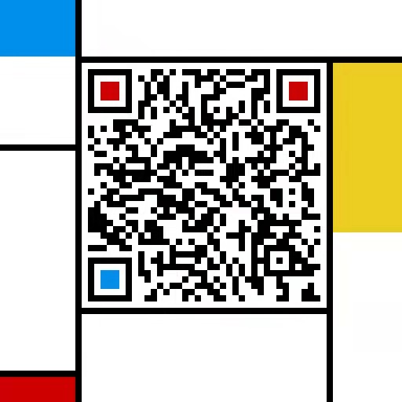

| GroupId       | ArtifactId                           | Snapshot Version                                                                                                                                                                                                                                                                       | Stable Version                                                                                                                                                                                                     |
|---------------|--------------------------------------|----------------------------------------------------------------------------------------------------------------------------------------------------------------------------------------------------------------------------------------------------------------------------------------|--------------------------------------------------------------------------------------------------------------------------------------------------------------------------------------------------------------------|
|com.baidu.cloud| starlight-all                        |                                                |                                                |
|com.baidu.cloud| spring-cloud-starter-baidu-starlight |  |  |

# Starlight: Lightweight Java RPC Framework
Starlight 是一套面向云原生的微服务通信框架，兼容Spring生态，基于此可快速构建高效、稳定、可控、可观测的微服务应用，获得研发效率提升、业务稳定性增强等舒适体验。
核心特性如下：
* 多种协议支持：Starlight单端口支持[brpc](https://github.com/apache/incubator-brpc)、Spring MVC REST协议，提供超丰富的使用场景
* 高性能远程通信：Starlight基于多路复用的NIO框架封装底层通信能力，提供高性能高并发网络通信能力
* 易于使用：无需处理protobuf编译过程，通过原生Java接口和POJO对象加上类级别的注解，类似Java RMI和Spring MVC使用体验，即可实现brpc二进制协议的Server和Client；支持无损升级、异常实例摘除；规范化的日志可以秒级定位超时问题、序列化失败问题

详细使用和设计文档参见[Github Wiki](https://github.com/baidu/starlight/wiki)

## JDK Requirements
minimum JDK 8

## License
baidu/starlight is licensed under the Apache License 2.0

# 微信交流群
添加管理员olivaw2077帮忙加群，备注starlight

