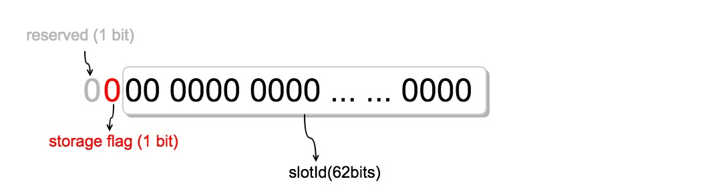

`FastFutureStore`是一个并发安全的、比`ConcurrentHashMap`更快的k-v存储组件，其实现思路为使用数组作为底层存储结构，同时将key的一部分bit解析为数组下标以达到快速查找、插入的目的，因此使用此组件硬性要求是key只能为long类型。Benchmark显示在多线程环境下，`FastFutureStore`比 JDK1.8 的`ConcurrentHashMap`快20% ~ 50%。

## 实现原理

`FastFutureStore`会使用数组和`ConcurrentHashMap`来存储`RpcFuture`对象，如果数组容量不足则会降级存储至Map中。

### 在logId中存储对象位置信息

调用`put(RpcFuture)`方法添加对象时会返回一个long类型的logId，其组成结构如下图所示:

第 0 ~ 62 位用来存储数组下标，第 63 位表示此logId存储位置(数组或ConcurrentHashMap), 最高位为保留位无特殊含义;

### 查找操作

S1: 判断logId第63位是否为1, 如果是则直接从Map中取出对象, 否则进入S2;

S2: 将0 ~ 62位解析为数组下标, 验证下标合法后，CAS直接从数组中取出并删除目标对象，返回;

### 添加操作

`FastFutureStore`维护了一个原子类型的计数器`slotCounter`, 初始值为0, 当调用put方法添加对象时会执行以下步骤:

S1: 将`slotCounter`做`getAndIncrement()`操作，把返回值与数组最大容量执行取余操作，其结果就是此对象的数组下标`slot`;

S2: 检查`slotCounter`是否大于等于`0x1 << 62`, 为真则重置为0;

S3: 使用CAS操作尝试将`array[slot]`设置为目标对象，当且仅当`slot`对应的元素为null时CAS才会成功;

S4: 如果成功，则返回`slotCounter`值; 如果失败，说明此位置已被占用，回到S1;

S5: 如果循环次数达到了数组最大容量，说明此时数组已满，则将对象以`slotCounter`为key降级存储至`ConcurrentHashMap`中，同时将 storage flag bit置为1;

因为性能的原因，`FastFutreStore`不会自动扩容底层数组，而是使用`ConcurrentHashMap`做为容量不足时的备用存储方式，因此数组容量的大小至关重要，过大会浪费内存，过小会因空间不足而退化成Map。建议根据client端的最大请求qps来设置此值。